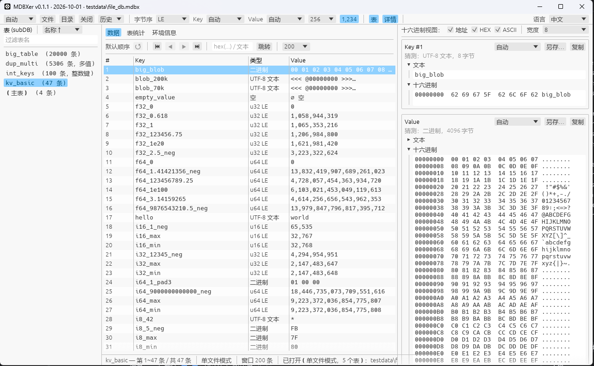

# MDBXer

[libmdbx](https://libmdbx.dqdkfa.ru/) 数据库的**只读**图形查看工具，界面参考 MDB Ray。Rust 2024 + egui 0.36 实现，单文件分发，跨平台（Windows / Linux / macOS）。

> 向 libmdbx 及其作者 Leonid Yuriev 致敬——本工具内置俄语界面（Русский）。



## 下载

预编译版本见 [GitHub Releases](https://github.com/lwq2015/mdbxer/releases)（含 Windows x86_64 / Linux x86_64 / macOS Apple Silicon），[Gitee Releases](https://gitee.com/lwq_yu/mdbxer/releases) 为镜像。macOS 仅提供 ARM 包，Intel Mac 可经 Rosetta 2 运行。

## 功能特性

### 打开方式
- **文件 / 目录 / 自动**三种模式，对应 MDBX 的 `MDBX_NOSUBDIR`
- 系统文件对话框、历史记录下拉、**拖入窗口**、命令行传路径
- `accede` 只读打开，可查看正被其他进程占用的库；**绝不写入数据库**
- 历史记录最多 20 条，同路径去重置顶，持久化到 `%APPDATA%\mdbxer\history.json`

### 数据浏览
- **锚点分页**：无需 COUNT，翻页成本与表大小无关；每页 50/100/200/500/1000 条
- **多值表（DUP_SORT）按 Key 分组**：每个 Key 只占一行，避免某 Key 值过多霸占整页
- 列头点击排序（Key 切换全局方向，其余列页内排序）、`↺` 恢复原始顺序
- 跳转定位：`hex(...)` / `0x...` / 文本 / 十进制（INTEGER_KEY 表）

### 多值导航（右栏）
- 逐值 `◀ ▶`、翻页 `⏪ ⏩`（±100）、首/末值 `⏮ ⏭`
- 序号跳转、按内容搜索（文本或字节子串，支持回绕）
- 每 100 个值一页懒加载

### 格式解析（17 种）
`自动 / utf8 / utf16(LE) / utf16(BE) / int8 / int16 / int32 / int64 / uint8 / uint16 / uint32 / uint64 / float / double / hex / dec / binary`

- 自动猜测类型（UTF-8 / u64 / u32 / u16 / 二进制）
- 字节序 LE/BE 切换；短字节零扩展补齐并标注
- `uint64` 落在 Unix 时间戳区间时自动附本地日期时间
- 千位分隔开关、单元格字符数截断（64–4096）

### 大字段分段
- 超过 64 KiB 的字段按段浏览，段内文本与 hex 只渲染当前窗口
- hex dump 三段独立开关（地址 / HEX / ASCII），行宽 4/8/16/32

### 统计与环境信息
- 表统计：条目数、B+树深度、分支/叶子/溢出页数、页大小、总大小、表标志
- 环境信息：文件几何、映射大小、页数、事务 ID、读者槽位等

### 多语言
- 中文 / English / Русский，顶栏右侧下拉切换，**即时生效**
- 首启按系统区域自动猜测，选择持久化到 `config.json`

### 其他
- Key/Value 复制完整解码文本、另存原始字节（不经截断/解码）
- 三栏宽度互相约束（左栏 180–320，中央表格保底 360）
- 工具栏下拉支持滚轮切换

## 构建与运行

需要 Rust 工具链（edition 2024，推荐 1.85+）。

```bash
# 开发运行
cargo run

# 发布构建（Windows 下不弹控制台）
cargo build --release

# 运行单元测试
cargo test
```

构建产物：`target/release/mdbxer`（Linux）或 `target\release\mdbxer.exe`（Windows）。

> 注意1：`mdbx-sys` 编译时需目标平台原生 C 头文件，**不支持交叉编译**，Linux 构建须在 Linux 环境进行。

> 注意2（Windows）：默认以 `+crt-static` 静态链接 MSVC 运行时（见 `.cargo/config.toml`），产物**不依赖 `vcruntime140.dll` / `ucrtbase.dll`** 等 VC 运行时，可直接拷到任意 Win10/11 上运行，无需安装 VC++ Redistributable。

## 测试数据

`examples/make_test_db.rs` 可生成包含普通表、多值表、INTEGER_KEY 表及大字段的测试库：

```bash
cargo run --example make_test_db
```

## 许可证

[Apache-2.0](LICENSE)

本项目静态链接 libmdbx（OpenLDAP Public License 2.8），相关声明见 [NOTICE](NOTICE)。

---

## 免责声明

1. **只读保证**：本工具以 `Mode::ReadOnly` + `accede` 方式打开数据库，**不会对数据库文件执行任何写入操作**。但用户仍应在使用前自行备份重要数据。

2. **按"原样"提供**：本软件按 Apache License 2.0 的条款"按原样"分发，**不提供任何明示或暗示的担保**，包括但不限于适销性、特定用途适用性和非侵权性的担保。在任何情况下，作者或版权持有人均不对因使用本软件而产生的任何索赔、损害或其他责任负责。

3. **数据安全**：虽然本工具设计为只读，但 MDBX 数据库文件可能因其他进程写入而处于不一致状态。本工具不对数据完整性、解析准确性或用户基于本工具输出做出的决策承担责任。

4. **使用风险**：用户自行承担使用本软件的全部风险。对于因使用本软件而导致的任何直接或间接损失（包括但不限于数据丢失、业务中断、利润损失），作者不承担责任。

5. **第三方组件**：本软件依赖 libmdbx 等第三方库，各组件的许可证条款和免责声明分别适用。请在分发时保留 [LICENSE](LICENSE) 与 [NOTICE](NOTICE) 文件。
